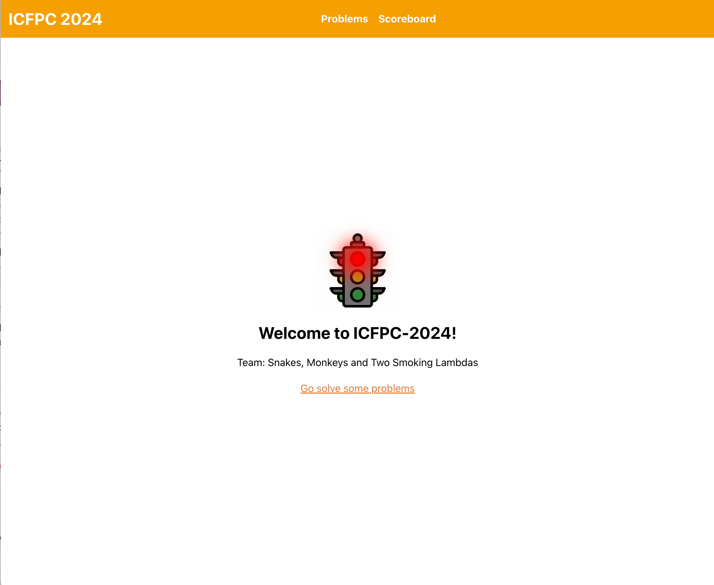

# ICFPC-2024

## Team: Snakes, Monkeys and Two Smoking Lambdas



## Overview

Core solvers are implemented in Python.

Assistive tech include:
 - UI and visualizer via React, Vite and Mantine
 - Helper server via Flask

## Setup

To get up and running you need Python ^3.10, Poetry and Docker.

On a Mac, simply run:

```zsh
git clone https://github.com/pankdm/icfpc-2024
cd ./icfpc-2024
./install_macos.sh

Install Python deps? [y,n]y
>>>>>> Installing Python deps
installed Python deps.

Install Docker deps? [y,n]y
>>>>>> Installing Docker
Docker already installed.
````

## Tools

To start the server and UI, use

```
make start
```

To execute one-off scripts, use preloaded Python repl via

```
make repl

Welcome to ICFPC-2023!
Team: Snakes, Monkeys and Two Smoking Lambdas

Modules:
  - ICFPC
  - server
  - scripts
  - slack
>>>
```


## Problems


### To download problems:

```
python3 language/downloader.py lambdaman 1 21
python3 language/downloader.py spaceship 1 25
```

### To upload solutions:

```
python3 language/uploader.py solutions/spaceship/best/ 1 25
```


### REPL to send commands to their server:

```
python3 language/repl.py repl
```

### Send a single command:

```
python3 language/repl.py send 'get spaceship'
```

### How to submit 3d:

1. Copy the cells from spreadsheet into N-input.txt file
2. Run `python solvers/python/3d/clean.py solutions/3d/manual/N-input.txt` to generate `N.txt`
3. Submit via  `python language/uploader.py solutions/3d/manual/ N N`